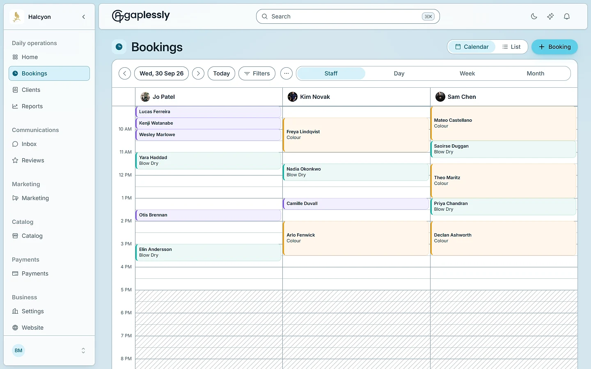
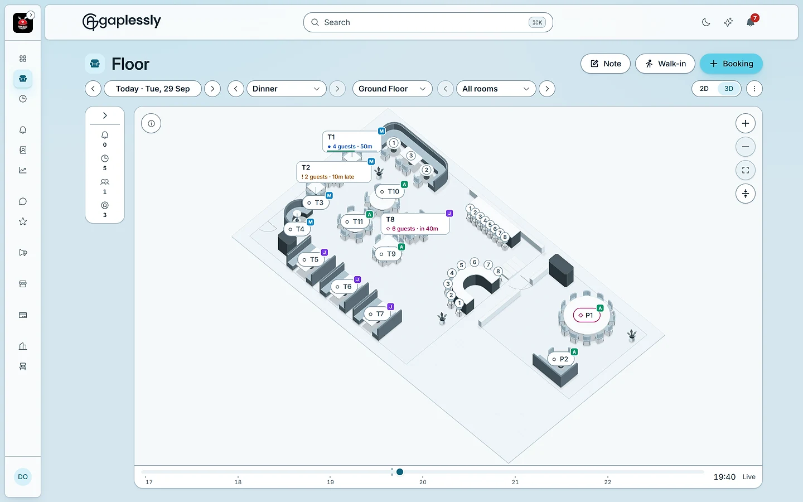

<p align="center">
  <a href="https://gaplessly.com">
    <picture>
      <source media="(prefers-color-scheme: dark)" srcset="./assets/gaplessly-logo-dark.svg">
      
    </picture>
  </a>
</p>

<p align="center">
  White-label booking software for appointment businesses and hospitality venues.<br>
  Built in Sydney. No commission and no per-cover fees, on any plan.
</p>

<p align="center">
  <a href="https://gaplessly.com"><b>Website</b></a>
  &nbsp;&middot;&nbsp;
  <a href="https://gaplessly.com/docs"><b>API reference</b></a>
  &nbsp;&middot;&nbsp;
  <a href="https://gaplessly.com/docs/mcp"><b>MCP server</b></a>
  &nbsp;&middot;&nbsp;
  <a href="https://gaplessly.com/pricing"><b>Pricing</b></a>
</p>

<p align="center">
  <a href="https://gaplessly.com/openapi.json"></a>
  <a href="https://registry.modelcontextprotocol.io/v0.1/servers?search=com.gaplessly/booking"></a>
  <a href="https://gaplessly.com"></a>
</p>

<br>

<table>
  <tr>
    <td width="50%" valign="top">
      <picture>
        <source media="(prefers-color-scheme: dark)" srcset="./assets/appointments-dark-1440.webp">
        
      </picture>
      <p><b>Appointments</b><br>
      Salons, barbers, clinics and studios. A calendar per staff member, real-time availability, reminders, and guests who reschedule for themselves.</p>
    </td>
    <td width="50%" valign="top">
      <picture>
        <source media="(prefers-color-scheme: dark)" srcset="./assets/hospitality-dark-1440.webp">
        
      </picture>
      <p><b>Hospitality</b><br>
      Restaurants, cafes and bars. Tables on a real floor plan, lunch and dinner as separate service periods, table combining and a live floor view.</p>
    </td>
  </tr>
</table>

## For developers

| Resource | What it is |
|---|---|
| [**API reference**](https://gaplessly.com/docs) | Every public endpoint, with its auth, scopes and status codes |
| [**OpenAPI 3.1**](https://gaplessly.com/openapi.json) | The same reference, machine-readable |
| [**API catalog**](https://gaplessly.com/.well-known/api-catalog) | The three APIs on gaplessly.com, as an RFC 9727 linkset |
| [**Auth and scopes**](https://gaplessly.com/.well-known/oauth-protected-resource) | RFC 9728 metadata. Keys go in an `Authorization: Bearer` header |
| [**MCP server**](https://gaplessly.com/docs/mcp) | For AI assistants helping a guest find a time. Read-only, no key needed |
| [**llms.txt**](https://gaplessly.com/llms.txt) | The whole product, summarised for language models |

### Connect an AI assistant

```bash
claude mcp add --transport http gaplessly https://gaplessly.com/api/mcp
```

Or ask the server for its tools directly:

```bash
curl -s https://gaplessly.com/api/mcp \
  -H 'Content-Type: application/json' \
  -H 'Accept: application/json, text/event-stream' \
  -d '{"jsonrpc":"2.0","id":1,"method":"tools/list"}'
```

## Contact

[hello@gaplessly.com](mailto:hello@gaplessly.com) &nbsp;&middot;&nbsp; [LinkedIn](https://www.linkedin.com/company/gaplessly/) &nbsp;&middot;&nbsp; [Instagram](https://www.instagram.com/gaplessly/) &nbsp;&middot;&nbsp; Sydney, Australia
